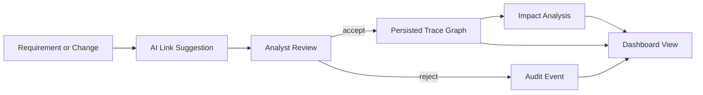
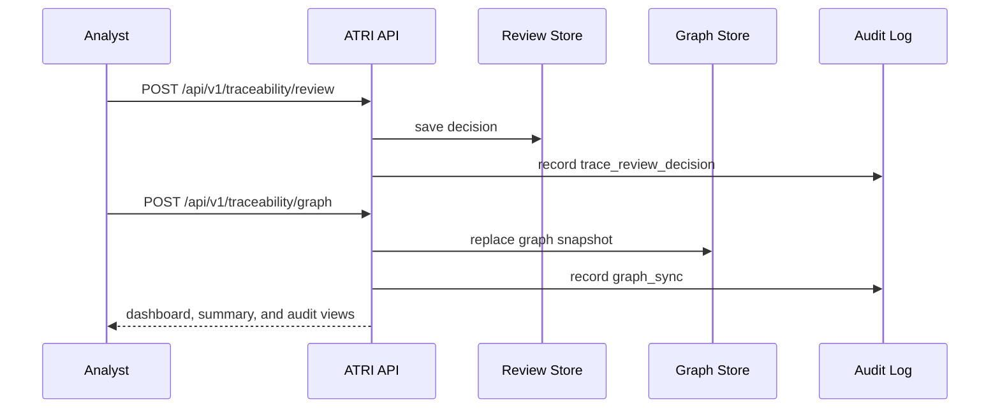
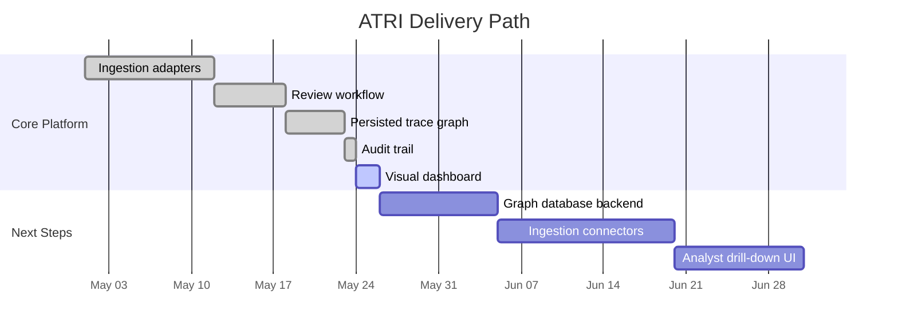

# Automated Traceability & Requirements Intelligence (ATRI)

ATRI is a mission-oriented scaffold for AI-assisted requirements traceability, automated change-impact analysis, intelligent gap detection, and real-time traceability dashboards.

The architecture is aligned to the needs of safety-critical software assurance practices like those used in NASA IV&V programs: requirements rigor, independent analysis, risk awareness, and end-to-end traceability from requirement -> design -> code -> test.

## Why This Project

Traditional traceability work is labor-intensive. ATRI is designed to reduce analyst hours while increasing review coverage through:

- AI-assisted requirement linking
- Automated impact analysis for upstream/downstream changes
- Gap detection across lifecycle artifacts
- Real-time dashboard APIs for coverage and risk posture

## Expanded Capability Map

- AI-assisted requirement linking across requirements, design, code, tests, hazards, and interfaces
- Automated change-impact analysis for affected design, code, test, hazard, and verification artifacts
- Intelligent gap detection for orphan requirements, missing tests, weak mitigations, and incomplete verification
- Analyst review workflow for accepting and rejecting suggested trace links
- Persisted trace graph for replayable impact analysis across stored links
- Audit trail for review and graph sync actions
- Visual dashboard page with cards, coverage, and SVG panels
- Real-time traceability dashboards for coverage, volatility, change activity, and risk posture

## Initial Architecture

- API Layer (FastAPI): endpoints for requirements, links, impact, and gap analysis
- Intelligence Layer: services for semantic linking, impact graph traversal, and gap heuristics
- Traceability Graph: graph model abstraction for requirement/design/code/test relationships
- Dashboard Feed: lightweight summary endpoint suitable for real-time frontends
- Compliance Mapping: hooks to map evidence to standards and IV&V-style checkpoints

See docs in `docs/` for detailed architecture and IV&V alignment.

> Note: the current scaffold persists review decisions, trace graph snapshots, and audit events to JSON files under `data/processed/`. That keeps the flow reproducible for local development while the team iterates toward a graph database backend.

## Visual Overview

## Operational Snapshot

| # | View | GitHub Feature | Why it matters |
| --- | --- | --- | --- |
| 1 | Trace coverage | Badge-style metric | Shows how much of the lifecycle is connected. |
| 2 | Review decisions | Mermaid sequence | Shows the analyst validation loop. |
| 3 | Graph health | Mermaid flowchart | Explains how stored links feed impact analysis. |
| 4 | Audit trail | Note blockquote | Documents evidence retention for IV&V reviews. |

The table summarizes what the dashboard should help reviewers see at a glance. The diagrams above show the data flow from suggestion to review, persistence, impact analysis, and reporting.

## What Ships Today

ATRI currently ships as a working scaffold with real API routes, persisted local stores, and a rendered dashboard page.

### Live Behaviors

- Suggest trace links from a requirement to candidate design, code, or test artifacts.
- Record analyst accept or reject decisions for suggested links.
- Persist trace graph snapshots for replayable impact analysis.
- Record audit events for review decisions and graph sync actions.
- Render a browser-friendly dashboard page from the same persisted stores used by the API.

### Current Persistence Model

| # | Store | Purpose | Format |
| --- | --- | --- | --- |
| 1 | Review store | Saves analyst accept/reject decisions. | JSON |
| 2 | Graph store | Stores artifact nodes and trace links. | JSON |
| 3 | Audit store | Records review and graph sync events. | JSON |

The table above shows the live stores that power the current local workflow. The JSON format keeps the scaffold easy to inspect while the graph backend is still evolving.

## End-to-End Workflow

1. Ingest or sketch an artifact set.
2. Suggest trace links with the API.
3. Review and validate the suggested links.
4. Sync accepted artifacts and links into the trace graph.
5. Analyze impact from the stored graph.
6. Review the dashboard for coverage, audit, and graph health.

## Feature Matrix

| # | Capability | API Surface | Notes |
| --- | --- | --- | --- |
| 1 | Link suggestion | /api/v1/traceability/link-suggest | Heuristic baseline with confidence and rationale. |
| 2 | Analyst review | /api/v1/traceability/review | Accept or reject suggested trace links. |
| 3 | Graph sync | /api/v1/traceability/graph | Persist artifacts and trace links for impact analysis. |
| 4 | Audit trail | /api/v1/traceability/audit/* | Capture evidence for review actions and graph updates. |
| 5 | Dashboard view | /api/v1/dashboard/view | Render a visual HTML summary with Mermaid-ready concepts. |

## Roadmap View

## GitHub Notes

- GitHub renders Mermaid diagrams directly in README markdown.
- GitHub renders pipe tables, checklists, and blockquotes without extra tooling.
- Local edits appear on GitHub only after the file is committed and pushed.

### Release Checklist

- [x] Core API routes are covered by tests.
- [x] Review decisions persist locally.
- [x] Trace graph snapshots persist locally.
- [x] Audit events persist locally.
- [x] Dashboard view renders in HTML.
- [ ] Graph database backend is still pending.
- [ ] Frontend drill-down UI is still pending.

The checklist is intentionally mixed, so it doubles as a short status report and a GitHub-rendered visual cue for what is already in place versus what remains.

## Quick Start

1. Create and activate a Python 3.11+ virtual environment.
2. Copy `.env.example` to `.env` and set values.
3. Install dependencies:
   - `make install`
4. Run API locally:
   - `make dev`
5. Run tests:
   - `make test`

## API Preview

- `GET /health` - service health
- `GET /api/v1/dashboard/summary` - high-level traceability KPIs
- `POST /api/v1/traceability/link-suggest` - suggest links for a requirement
- `POST /api/v1/traceability/review` - accept or reject a suggested trace link
- `GET /api/v1/traceability/reviews` - list review decisions
- `GET /api/v1/traceability/reviews/summary` - review counts by status
- `POST /api/v1/traceability/graph` - persist artifacts and trace links for impact analysis
- `GET /api/v1/traceability/audit/events` - list audit events for traceability actions
- `GET /api/v1/traceability/audit/summary` - count audit events by type
- `GET /api/v1/dashboard/view` - render the visual traceability dashboard
- `POST /api/v1/impact/analyze` - impact analysis from changed artifacts
- `POST /api/v1/gaps/detect` - detect missing or weak trace links

## Repository Layout

- `src/atri/` - application code
- `tests/` - test suite
- `docs/` - architecture and process docs
- `docker/` - container scaffolding
- `scripts/` - utility scripts

## Near-Term Roadmap

- Build ingestion adapters for DOORS, Jama, Visure, Word/PDF, and SysML sources
- Integrate vector retrieval for semantic linking
- Add graph database adapter (Neo4j)
- Add authn/authz, review state, and audit events
- Expand the review workflow with persistence and reviewer assignment
- Add a true graph database backend behind the trace graph store adapter
- Persist audit events to an immutable backend and expose reviewer history drill-downs
- Ship a richer dashboard experience with drill-down charts and artifact filters
- Ship frontend dashboard (React) connected to summary, capability, and drill-down APIs
