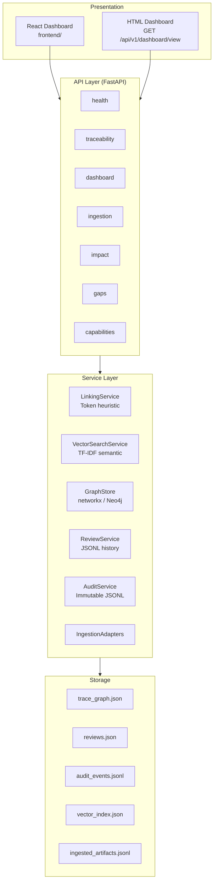
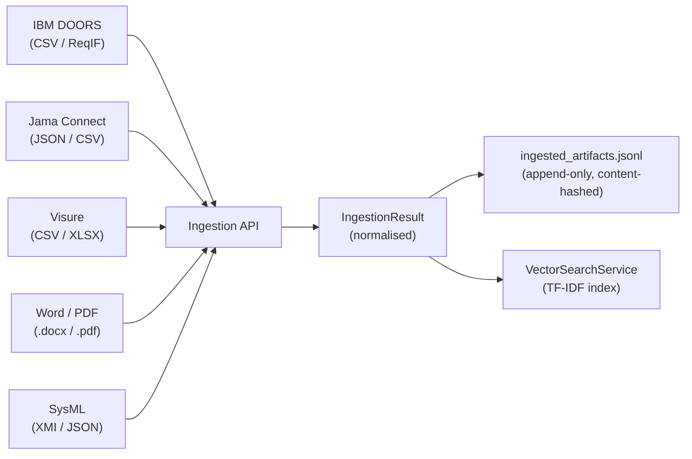
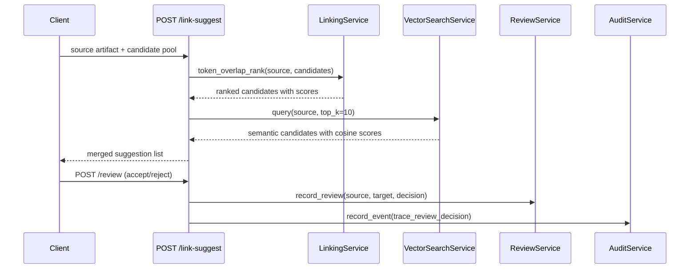
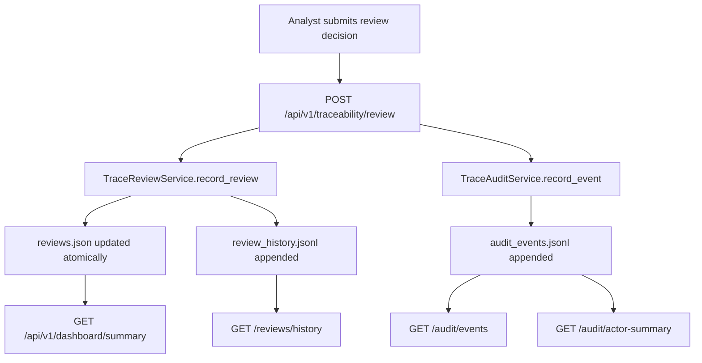
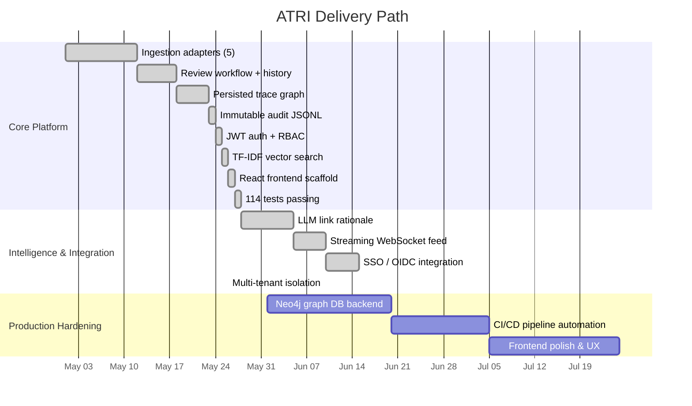

<div align="center">

# ATRI - Automated Traceability & Requirements Intelligence

[](https://www.python.org/)
[](https://fastapi.tiangolo.com/)
[](https://docs.pydantic.dev/)
[](https://neo4j.com/)
[](https://react.dev/)
[](LICENSE)
[]()
[]()

**AI-powered requirements traceability and impact analysis for safety-critical programs.**

*Built on the discipline of NASA IV&V: every requirement linked, every decision evidenced, every change impact tracked.*

</div>

---

## What is ATRI?

ATRI is a production-ready backend platform for automated requirements traceability. It ingests artifacts from all major requirements management tools, uses TF-IDF semantic analysis to suggest trace links between requirements, design elements, code modules, test cases, and hazard records. Every analyst decision is persisted to an immutable audit trail, and the trace graph is queryable for real-time change-impact analysis.

The platform was designed around the workflow challenges faced by safety-critical programs: avionics software following DO-178C, medical devices under IEC 62443, and space systems under NASA NPR 7150.2. In these environments, an analyst might need to prove that every safety requirement has been tested, that a last-minute design change cannot silently break a verification item, or that every hazard has a mitigation that is traceable to code. ATRI automates the mechanical parts of that workflow, leaving analysts free to focus on judgment calls.

> [!IMPORTANT]
> ATRI is not a replacement for human engineering judgment. It is a force multiplier. The AI-assisted linking pipeline surfaces candidates; the analyst makes every accept/reject decision. All decisions are permanently logged with a timestamp, actor, and rationale.

---

## Why This Exists

Traditional traceability work is done in spreadsheets, DOORS databases, or manually maintained requirement management tools. The review cycle is slow, the cross-references are brittle, and coverage metrics are almost always out of date. When a requirement changes, figuring out what else is affected requires a subject-matter expert, not a database query.

ATRI solves this by treating the traceability graph as a first-class data structure. Artifacts and links are nodes and edges. Impact analysis is a graph traversal. Gap detection is a set-difference operation. Review decisions are events in an append-only audit log. The entire thing is queryable through a REST API, renderable in a browser dashboard, and extensible with new ingestion adapters.

---

## Architecture

ATRI is organized into four horizontal layers: Ingestion, Services, API, and Presentation.



The Ingestion layer normalises artifacts from five external tool formats into a common `IngestionResult` schema. The Services layer contains all the business logic: semantic linking, graph persistence, review lifecycle management, and audit recording. The API layer is a thin FastAPI router that validates HTTP input and delegates to services. The Presentation layer is either the React SPA or the server-rendered HTML dashboard.

> [!NOTE]
> All storage is file-based by default, which makes local development and CI testing zero-dependency. The Neo4j adapter is available for production deployments and activates automatically when the `ATRI_NEO4J_URI` environment variable is set and the `neo4j` Python package is installed.

---

## Tech Stack

| # | Component | Technology | Version | Why It Was Chosen |
|---|-----------|-----------|---------|-------------------|
| <sub>1</sub> | <sub>API framework</sub> | <sub>FastAPI</sub> | <sub>0.136</sub> | <sub>Async-first, automatic OpenAPI docs, Pydantic-native validation</sub> |
| <sub>2</sub> | <sub>Config management</sub> | <sub>pydantic-settings</sub> | <sub>2.14</sub> | <sub>Type-safe env var loading with ATRI_ prefix scoping</sub> |
| <sub>3</sub> | <sub>Graph (local)</sub> | <sub>networkx</sub> | <sub>3.3</sub> | <sub>Zero-dependency directed graph for local dev and CI</sub> |
| <sub>4</sub> | <sub>Graph (prod)</sub> | <sub>Neo4j Python Driver</sub> | <sub>5.x</sub> | <sub>Cypher-native graph queries for large-scale production graphs</sub> |
| <sub>5</sub> | <sub>Semantic search</sub> | <sub>Pure Python TF-IDF</sub> | <sub>-</sub> | <sub>No heavy ML dependency; sufficient for requirement-body similarity</sub> |
| <sub>6</sub> | <sub>Auth</sub> | <sub>python-jose</sub> | <sub>3.5</sub> | <sub>JWT creation and verification; HMAC-SHA256 or RSA</sub> |
| <sub>7</sub> | <sub>Word/PDF ingestion</sub> | <sub>python-docx + PyMuPDF</sub> | <sub>1.2 / 1.27</sub> | <sub>Parse Word headings and PDF pages without external tools</sub> |
| <sub>8</sub> | <sub>Excel ingestion</sub> | <sub>openpyxl</sub> | <sub>3.1</sub> | <sub>Read Visure xlsx exports without requiring LibreOffice</sub> |
| <sub>9</sub> | <sub>XML ingestion</sub> | <sub>lxml</sub> | <sub>6.1</sub> | <sub>Robust namespace-aware parsing for DOORS ReqIF and SysML XMI</sub> |
| <sub>10</sub> | <sub>Frontend</sub> | <sub>React 18 + Vite</sub> | <sub>18.3 / 5.4</sub> | <sub>Fast HMR dev server; small production bundle</sub> |
| <sub>11</sub> | <sub>Charts</sub> | <sub>Recharts</sub> | <sub>2.12</sub> | <sub>Declarative SVG charts composable with React</sub> |
| <sub>12</sub> | <sub>File uploads</sub> | <sub>python-multipart</sub> | <sub>0.0.9</sub> | <sub>Required by FastAPI for multipart/form-data handling</sub> |

---

## Ingestion Adapters

ATRI can ingest requirements from five tool ecosystems. Each adapter normalises its source format into the same `IngestionResult` dataclass, which carries a SHA-256 content hash for deduplication and change detection.

| # | Adapter | Supported Formats | Typical Source | Notes |
|---|---------|-------------------|----------------|-------|
| <sub>1</sub> | <sub>DOORS</sub> | <sub>CSV, ReqIF XML, DOORS XML</sub> | <sub>IBM DOORS / DOORS Next</sub> | <sub>Flexible column mapping; handles variable column names</sub> |
| <sub>2</sub> | <sub>Jama</sub> | <sub>JSON (REST payload), CSV</sub> | <sub>Jama Connect API export</sub> | <sub>Maps 12 Jama item types to ATRI artifact types</sub> |
| <sub>3</sub> | <sub>Visure</sub> | <sub>CSV, Excel (.xlsx)</sub> | <sub>Visure Solutions export</sub> | <sub>openpyxl for xlsx; same column mapping logic as DOORS</sub> |
| <sub>4</sub> | <sub>Word/PDF</sub> | <sub>.docx, .pdf</sub> | <sub>Free-form documents, SOWs</sub> | <sub>Groups by heading for Word; page-per-artifact for PDF</sub> |
| <sub>5</sub> | <sub>SysML</sub> | <sub>SysML v1 XMI, SysML v2 JSON</sub> | <sub>Cameo, Capella, SysML v2 Pilot</sub> | <sub>Handles namespace stripping; maps Block/Requirement/UseCase types</sub> |

> [!TIP]
> To add a new adapter, subclass `BaseIngestionAdapter` in `src/atri/ingestion/`, implement the `ingest()` method, and register your adapter in `src/atri/api/routes/ingestion.py`. The content hash and JSONL persistence are handled automatically by the base class.



---

## Service Layer

| # | Service | Responsibility | Storage |
|---|---------|---------------|---------|
| <sub>1</sub> | <sub>LinkingService</sub> | <sub>Token-overlap heuristic linking for fast candidate generation</sub> | <sub>None (stateless)</sub> |
| <sub>2</sub> | <sub>VectorSearchService</sub> | <sub>TF-IDF semantic similarity index; build, query, persist</sub> | <sub>vector_index.json</sub> |
| <sub>3</sub> | <sub>TraceGraphStore (networkx)</sub> | <sub>In-memory directed graph; adjacency map, stats, downstream traversal</sub> | <sub>trace_graph.json</sub> |
| <sub>4</sub> | <sub>Neo4jGraphStore</sub> | <sub>Production graph adapter; MERGE upserts, Cypher traversal, graceful fallback</sub> | <sub>Neo4j 5 bolt</sub> |
| <sub>5</sub> | <sub>TraceReviewService</sub> | <sub>Review lifecycle: pending / accepted / rejected; reviewer assignment; JSONL history</sub> | <sub>reviews.json + review_history.jsonl</sub> |
| <sub>6</sub> | <sub>TraceAuditService</sub> | <sub>Immutable append-only JSONL event log; actor summary; subject history; pagination</sub> | <sub>audit_events.jsonl</sub> |
| <sub>7</sub> | <sub>DOORSAdapter</sub> | <sub>DOORS CSV and ReqIF XML ingestion</sub> | <sub>ingested_artifacts.jsonl</sub> |
| <sub>8</sub> | <sub>JamaAdapter</sub> | <sub>Jama Connect JSON REST payload and CSV ingestion</sub> | <sub>ingested_artifacts.jsonl</sub> |

### Semantic Linking Pipeline

The linking pipeline has two stages. The first stage uses a fast token-overlap heuristic (`LinkingService`) to generate a ranked candidate list in microseconds. The second stage uses the TF-IDF semantic index (`VectorSearchService`) to re-rank or supplement that list using cosine similarity on TF-IDF weighted requirement bodies. Neither stage requires an external ML service or GPU - the entire pipeline runs in the API process.



---

## API Reference

<details>
<summary><strong>All API Endpoints (click to expand)</strong></summary>

### Health

| # | Method | Path | Description |
|---|--------|------|-------------|
| <sub>1</sub> | <sub>GET</sub> | <sub>/health</sub> | <sub>Liveness check; returns version, uptime indicator, and store status</sub> |

### Dashboard

| # | Method | Path | Description |
|---|--------|------|-------------|
| <sub>2</sub> | <sub>GET</sub> | <sub>/api/v1/dashboard/summary</sub> | <sub>High-level KPIs: trace coverage, review counts, audit event totals, graph stats</sub> |
| <sub>3</sub> | <sub>GET</sub> | <sub>/api/v1/dashboard/view</sub> | <sub>Browser-renderable HTML dashboard with SVG charts</sub> |

### Traceability

| # | Method | Path | Description |
|---|--------|------|-------------|
| <sub>4</sub> | <sub>POST</sub> | <sub>/api/v1/traceability/link-suggest</sub> | <sub>Suggest trace link candidates for a source artifact</sub> |
| <sub>5</sub> | <sub>POST</sub> | <sub>/api/v1/traceability/review</sub> | <sub>Record an accepted or rejected review decision</sub> |
| <sub>6</sub> | <sub>GET</sub> | <sub>/api/v1/traceability/reviews</sub> | <sub>List all current review records</sub> |
| <sub>7</sub> | <sub>GET</sub> | <sub>/api/v1/traceability/reviews/summary</sub> | <sub>Review counts by decision status</sub> |
| <sub>8</sub> | <sub>GET</sub> | <sub>/api/v1/traceability/reviews/history</sub> | <sub>Full immutable history trail with optional filters</sub> |
| <sub>9</sub> | <sub>GET</sub> | <sub>/api/v1/traceability/reviews/reviewer-summary</sub> | <sub>Per-reviewer decision count breakdown</sub> |
| <sub>10</sub> | <sub>POST</sub> | <sub>/api/v1/traceability/review/assign</sub> | <sub>Assign a named reviewer to a trace link</sub> |
| <sub>11</sub> | <sub>POST</sub> | <sub>/api/v1/traceability/graph</sub> | <sub>Replace the trace graph with a new artifact + link snapshot</sub> |
| <sub>12</sub> | <sub>GET</sub> | <sub>/api/v1/traceability/audit/events</sub> | <sub>Paginated audit event list with optional type/actor/subject filters</sub> |
| <sub>13</sub> | <sub>GET</sub> | <sub>/api/v1/traceability/audit/summary</sub> | <sub>Audit event counts grouped by type</sub> |
| <sub>14</sub> | <sub>GET</sub> | <sub>/api/v1/traceability/audit/actor-summary</sub> | <sub>Per-actor audit event breakdown for reviewer drill-down</sub> |
| <sub>15</sub> | <sub>GET</sub> | <sub>/api/v1/traceability/audit/subject/{subject_id}</sub> | <sub>Full audit history for a specific artifact or link</sub> |
| <sub>16</sub> | <sub>POST</sub> | <sub>/api/v1/traceability/vector/build</sub> | <sub>Build the TF-IDF semantic index from an artifact list</sub> |
| <sub>17</sub> | <sub>POST</sub> | <sub>/api/v1/traceability/vector/query</sub> | <sub>Query the TF-IDF index for semantically similar artifacts</sub> |
| <sub>18</sub> | <sub>POST</sub> | <sub>/api/v1/traceability/link-explain</sub> | <sub>LLM-enriched rationale for a source-target trace link; heuristic fallback when disabled</sub> |

### Streaming

| # | Method | Path | Description |
|---|--------|------|-------------|
| <sub>19</sub> | <sub>WS</sub> | <sub>/api/v1/stream/events</sub> | <sub>WebSocket - push audit events and dashboard snapshots in real time (`?topic=audit\|dashboard\|all`)</sub> |
| <sub>20</sub> | <sub>GET</sub> | <sub>/api/v1/stream/status</sub> | <sub>Number of currently connected WebSocket clients</sub> |

### Impact and Gaps

| # | Method | Path | Description |
|---|--------|------|--------------|
| <sub>21</sub> | <sub>POST</sub> | <sub>/api/v1/impact/analyze</sub> | <sub>Compute upstream and downstream impact from changed artifacts</sub> |
| <sub>22</sub> | <sub>POST</sub> | <sub>/api/v1/gaps/detect</sub> | <sub>Detect orphan requirements, missing tests, and weak mitigations</sub> |

### Ingestion

| # | Method | Path | Description |
|---|--------|------|-------------|
| <sub>23</sub> | <sub>POST</sub> | <sub>/api/v1/ingestion/upload/{source_type}</sub> | <sub>Upload a file (CSV, XML, XLSX, DOCX, PDF, JSON) for ingestion</sub> |
| <sub>24</sub> | <sub>GET</sub> | <sub>/api/v1/ingestion/sources</sub> | <sub>List supported source adapter names</sub> |

### Capabilities

| # | Method | Path | Description |
|---|--------|------|-------------|
| <sub>25</sub> | <sub>GET</sub> | <sub>/api/v1/capabilities</sub> | <sub>Enumerate platform capabilities and their status</sub> |

</details>

> [!NOTE]
> Full interactive API documentation is available at `http://localhost:8000/docs` (Swagger UI) and `http://localhost:8000/redoc` (ReDoc) when the server is running. No extra setup is required - FastAPI generates these automatically from the route definitions.

---

## Security and Authentication

ATRI uses JWT Bearer token authentication with Role-Based Access Control (RBAC). Authentication can be disabled for local development by setting `ATRI_AUTH_ENABLED=false`.

### RBAC Role Matrix

| # | Role | Link Suggest | Review | Assign Reviewer | View Audit | Admin Operations |
|---|------|-------------|--------|-----------------|------------|-----------------|
| <sub>1</sub> | <sub>admin</sub> | <sub>yes</sub> | <sub>yes</sub> | <sub>yes</sub> | <sub>yes</sub> | <sub>yes</sub> |
| <sub>2</sub> | <sub>reviewer</sub> | <sub>yes</sub> | <sub>yes</sub> | <sub>yes</sub> | <sub>yes</sub> | <sub>no</sub> |
| <sub>3</sub> | <sub>analyst</sub> | <sub>yes</sub> | <sub>yes</sub> | <sub>no</sub> | <sub>yes</sub> | <sub>no</sub> |
| <sub>4</sub> | <sub>viewer</sub> | <sub>no</sub> | <sub>no</sub> | <sub>no</sub> | <sub>yes</sub> | <sub>no</sub> |

> [!WARNING]
> Set `ATRI_SECRET_KEY` to a cryptographically strong random string (minimum 32 bytes) before deploying to any shared or internet-facing environment. The default value in `.env.example` is a placeholder only and must not be used in production.

**To obtain a token in development:**

```bash
# Generate a JWT via the auth helper (available when auth is enabled)
python -c "from atri.api.auth import create_access_token; print(create_access_token('alice', ['analyst']))"

# Use it in requests
curl -H "Authorization: Bearer <token>" http://localhost:8000/api/v1/dashboard/summary
```

### SSO / OIDC Integration

When `ATRI_OIDC_ENABLED=true`, ATRI accepts Bearer tokens issued by any standards-compliant OIDC Identity Provider (IdP) - including Okta, Microsoft Azure AD, Keycloak, and Auth0 - without requiring a separate ATRI-specific shared secret.

```bash
# Example: configure for Okta
ATRI_OIDC_ENABLED=true
ATRI_OIDC_ISSUER=https://your-org.okta.com/oauth2/default
ATRI_OIDC_CLIENT_ID=0oa...
ATRI_OIDC_AUDIENCE=api://default
```

ATRI discovers the JWKS endpoint automatically from `{issuer}/.well-known/jwks.json` and caches keys for 5 minutes. Roles are extracted from the `roles`, `groups`, `cognito:groups`, or `realm_access.roles` claim - whichever is present - and mapped directly to the ATRI RBAC role matrix. When none of those claims are present, the token is accepted with the `viewer` role.

> [!TIP]
> OIDC and local JWT auth can coexist. If `ATRI_OIDC_ENABLED=true`, ATRI tries the shared-secret check first, then OIDC, then local JWT - so existing integrations continue to work without changes.

### Multi-Tenant Isolation

When `ATRI_MULTI_TENANT_ENABLED=true`, every data store is scoped to the tenant resolved from the `X-Tenant-ID` request header. Each tenant's reviews, audit events, trace graph, vector index, and ingested artifacts are stored in a separate directory under `ATRI_TENANT_DATA_ROOT/{tenant_id}/` with no cross-contamination possible.

```bash
# Requests for tenant "acme-corp" read/write data/tenants/acme-corp/
curl -H "X-Tenant-ID: acme-corp" -H "Authorization: Bearer <token>" \
  http://localhost:8000/api/v1/traceability/reviews

# Requests for tenant "nasa-ivv" are fully isolated
curl -H "X-Tenant-ID: nasa-ivv" -H "Authorization: Bearer <token>" \
  http://localhost:8000/api/v1/traceability/reviews
```

Tenant IDs are validated against `[a-zA-Z0-9_-]{1,64}` before being used in any path operation, preventing directory traversal attacks. When the header is absent the request falls back to `ATRI_DEFAULT_TENANT_ID` (default: `default`). In single-tenant mode (the default) the header is ignored and all requests use the global `settings.*_path` values.

---

## Data Flow and Audit Trail

The audit trail is the most important compliance feature in ATRI. Every mutating action - link suggestion, review decision, reviewer assignment, graph sync, ingestion - produces an immutable JSONL event appended to `audit_events.jsonl`. This file is never modified; new events are always appended. The design follows the event-sourcing pattern used in financial and medical systems where it is not permissible to alter the historical record.



Each audit event contains: `event_type`, `subject_id`, `actor`, `timestamp` (ISO 8601 UTC), and a `details` dict. The `actor_summary` endpoint aggregates events by actor, giving compliance reviewers a per-analyst activity report. The `subject_history` endpoint shows the complete change history for a specific artifact or trace link.

> [!IMPORTANT]
> Never delete or truncate `audit_events.jsonl` in a production deployment. If the file is lost, the audit trail for that period cannot be reconstructed. Use the Docker volume mounts in `docker/docker-compose.yml` to persist the data directory outside the container lifecycle.

---

## Configuration Reference

All configuration is loaded from environment variables with the `ATRI_` prefix. A `.env` file is supported for local development.

| # | Variable | Default | Required | Description |
|---|----------|---------|----------|-------------|
| <sub>1</sub> | <sub>ATRI_APP_NAME</sub> | <sub>ATRI</sub> | <sub>no</sub> | <sub>Display name in OpenAPI docs</sub> |
| <sub>2</sub> | <sub>ATRI_AUTH_ENABLED</sub> | <sub>true</sub> | <sub>no</sub> | <sub>Set false to bypass auth for local dev</sub> |
| <sub>3</sub> | <sub>ATRI_SECRET_KEY</sub> | <sub>(placeholder)</sub> | <sub>yes (prod)</sub> | <sub>HMAC key for JWT signing - must be 32+ chars</sub> |
| <sub>4</sub> | <sub>ATRI_JWT_ALGORITHM</sub> | <sub>HS256</sub> | <sub>no</sub> | <sub>JWT signing algorithm</sub> |
| <sub>5</sub> | <sub>ATRI_JWT_EXPIRY_MINUTES</sub> | <sub>60</sub> | <sub>no</sub> | <sub>Token lifetime in minutes</sub> |
| <sub>6</sub> | <sub>ATRI_REVIEW_STORE_PATH</sub> | <sub>data/processed/reviews.json</sub> | <sub>no</sub> | <sub>Current review state file</sub> |
| <sub>7</sub> | <sub>ATRI_REVIEW_HISTORY_STORE_PATH</sub> | <sub>data/processed/review_history.jsonl</sub> | <sub>no</sub> | <sub>Immutable review history log</sub> |
| <sub>8</sub> | <sub>ATRI_AUDIT_STORE_PATH</sub> | <sub>data/processed/audit_events.jsonl</sub> | <sub>no</sub> | <sub>Immutable audit event log</sub> |
| <sub>9</sub> | <sub>ATRI_INGESTION_STORE_PATH</sub> | <sub>data/processed/ingested_artifacts.jsonl</sub> | <sub>no</sub> | <sub>Persisted ingested artifact records</sub> |
| <sub>10</sub> | <sub>ATRI_NEO4J_URI</sub> | <sub>(empty)</sub> | <sub>no</sub> | <sub>Neo4j bolt URI - activates the Neo4j adapter when set</sub> |
| <sub>11</sub> | <sub>ATRI_OPENAI_API_KEY</sub> | <sub>(empty)</sub> | <sub>no</sub> | <sub>OpenAI API key for LLM-enriched link rationale (`link-explain` endpoint)</sub> |
| <sub>12</sub> | <sub>ATRI_LLM_RATIONALE_ENABLED</sub> | <sub>false</sub> | <sub>no</sub> | <sub>Set true to call OpenAI/Azure for rationale; false uses heuristic fallback</sub> |
| <sub>13</sub> | <sub>ATRI_OPENAI_MODEL</sub> | <sub>gpt-4o-mini</sub> | <sub>no</sub> | <sub>OpenAI model name for rationale generation</sub> |
| <sub>14</sub> | <sub>ATRI_AZURE_OPENAI_ENDPOINT</sub> | <sub>(empty)</sub> | <sub>no</sub> | <sub>Azure OpenAI endpoint URL; takes priority over ATRI_OPENAI_API_KEY when set</sub> |
| <sub>15</sub> | <sub>ATRI_OIDC_ENABLED</sub> | <sub>false</sub> | <sub>no</sub> | <sub>Set true to accept tokens from an external OIDC IdP (Okta, Azure AD, Keycloak)</sub> |
| <sub>16</sub> | <sub>ATRI_OIDC_ISSUER</sub> | <sub>(empty)</sub> | <sub>no</sub> | <sub>OIDC issuer URL; JWKS discovered at `{issuer}/.well-known/jwks.json` if ATRI_OIDC_JWKS_URI not set</sub> |
| <sub>17</sub> | <sub>ATRI_OIDC_JWKS_URI</sub> | <sub>(empty)</sub> | <sub>no</sub> | <sub>Explicit JWKS endpoint URL; cached for 5 minutes</sub> |
| <sub>18</sub> | <sub>ATRI_OIDC_AUDIENCE</sub> | <sub>(empty)</sub> | <sub>no</sub> | <sub>Expected JWT audience claim value</sub> |
| <sub>19</sub> | <sub>ATRI_MULTI_TENANT_ENABLED</sub> | <sub>false</sub> | <sub>no</sub> | <sub>Set true to scope all stores to `X-Tenant-ID` header; default tenant used when header absent</sub> |
| <sub>20</sub> | <sub>ATRI_DEFAULT_TENANT_ID</sub> | <sub>default</sub> | <sub>no</sub> | <sub>Fallback tenant ID when X-Tenant-ID header is absent</sub> |
| <sub>21</sub> | <sub>ATRI_TENANT_DATA_ROOT</sub> | <sub>data/tenants</sub> | <sub>no</sub> | <sub>Root directory for per-tenant data stores</sub> |

---

## Workflow Walkthrough

This section walks through a complete end-to-end traceability workflow from artifact ingestion through to impact analysis.

**Step 1 - Ingest requirements from DOORS:**

```bash
curl -X POST http://localhost:8000/api/v1/ingestion/upload/doors \
  -F "file=@my_requirements.csv"
```

The DOORS adapter reads the CSV, maps column names flexibly, and returns a list of normalised artifact records. Each record gets a SHA-256 content hash computed from its title and body.

**Step 2 - Build the semantic index:**

```bash
curl -X POST http://localhost:8000/api/v1/traceability/vector/build \
  -H "Content-Type: application/json" \
  -d '{"artifacts": [...]}'
```

The TF-IDF index is built from all ingested artifacts. Subsequent `/link-suggest` calls can use this index to find semantically similar candidates using cosine similarity.

**Step 3 - Suggest trace links:**

```bash
curl -X POST http://localhost:8000/api/v1/traceability/link-suggest \
  -H "Content-Type: application/json" \
  -d '{"source": {"artifact_id": "REQ-001", "artifact_type": "requirement", "title": "Login", "body": "System shall authenticate all users."}, "candidates": [...]}'
```

**Step 4 - Review and accept links:**

```bash
curl -X POST http://localhost:8000/api/v1/traceability/review \
  -H "Content-Type: application/json" \
  -d '{"source_id": "REQ-001", "target_id": "TC-042", "decision": "accepted", "reviewer": "alice", "comments": "Verified against DO-178C trace matrix"}'
```

**Step 5 - Analyze impact of a change:**

```bash
curl -X POST http://localhost:8000/api/v1/impact/analyze \
  -H "Content-Type: application/json" \
  -d '{"changed_artifact_ids": ["REQ-001"], "direction": "downstream"}'
```

> [!TIP]
> Use the interactive Swagger UI at `http://localhost:8000/docs` to explore and test every endpoint without writing curl commands. The schema for every request and response is shown inline.

---

## Repository Layout

```
automated-traceability-requirements-intelligence/
├── src/atri/                    # Application source
│   ├── main.py                  # FastAPI app factory and router registration
│   ├── config.py                # pydantic-settings with ATRI_ prefix
│   ├── api/
│   │   ├── auth.py              # JWT + RBAC middleware
│   │   ├── schemas.py           # All Pydantic request/response models
│   │   └── routes/
│   │       ├── health.py
│   │       ├── traceability.py  # Link suggest, review, graph, audit
│   │       ├── dashboard.py     # Summary KPIs and HTML view
│   │       ├── ingestion.py     # File upload ingestion endpoint
│   │       ├── impact.py        # Change-impact graph traversal
│   │       ├── gaps.py          # Gap detection heuristics
│   │       └── capabilities.py  # Feature enumeration
│   ├── core/
│   │   ├── models/trace.py      # Artifact and TraceLink dataclasses
│   │   ├── services/
│   │   │   ├── linking.py       # Token-overlap heuristic linker
│   │   │   ├── vector_store.py  # TF-IDF semantic search index
│   │   │   ├── graph_store.py   # networkx DiGraph (local dev)
│   │   │   ├── neo4j_store.py   # Neo4j adapter (production)
│   │   │   ├── review.py        # Review lifecycle + JSONL history
│   │   │   └── audit.py         # Immutable JSONL audit trail
│   │   └── pipelines/           # (reserved for ML pipeline chains)
│   └── ingestion/
│       ├── base.py              # IngestionResult + BaseIngestionAdapter
│       ├── doors.py             # IBM DOORS CSV / ReqIF XML
│       ├── jama.py              # Jama Connect JSON / CSV
│       ├── visure.py            # Visure CSV / XLSX
│       ├── word_pdf.py          # Word .docx + PDF via PyMuPDF
│       └── sysml.py             # SysML v1 XMI + v2 JSON
├── frontend/                    # React 18 + Vite dashboard
│   ├── src/
│   │   ├── App.jsx              # SPA router and nav bar
│   │   └── components/
│   │       ├── Dashboard.jsx    # KPI cards + Recharts
│   │       ├── Traceability.jsx # Review list and submission form
│   │       └── Ingestion.jsx    # File upload form
│   ├── package.json
│   └── vite.config.js
├── tests/                       # pytest test suite (114 tests)
│   ├── test_health.py
│   ├── test_api_routes.py
│   ├── test_ingestion_adapters.py
│   ├── test_vector_store.py
│   ├── test_auth.py
│   ├── test_review_audit_service.py
│   ├── test_llm_rationale.py
│   ├── test_stream.py
│   ├── test_oidc.py
│   └── test_tenant.py
├── docker/
│   ├── docker-compose.yml       # API + Postgres + Redis + Neo4j
│   └── Dockerfile.api
├── docs/
│   ├── architecture.md
│   ├── ivv-alignment.md
│   └── roadmap.md
├── data/
│   └── processed/               # Runtime data files (git-ignored in prod)
├── pyproject.toml               # PEP 517 build config and dependencies
├── Makefile                     # Dev workflow shortcuts
└── README.md
```

---

## Quick Start

### Prerequisites

- Python 3.11 or later
- Node.js 20+ (for the React frontend only)
- Docker and Docker Compose (optional, for full stack)

### Local Development (API only)

```bash
# 1. Clone and enter the project
git clone <repo-url>
cd automated-traceability-requirements-intelligence

# 2. Create virtual environment
python -m venv .venv
source .venv/bin/activate     # Windows: .venv\Scripts\activate

# 3. Install Python dependencies
pip install -e ".[dev]"

# 4. Copy and edit the environment file
cp .env.example .env
# Edit .env: set ATRI_AUTH_ENABLED=false for local dev

# 5. Start the API
make dev
# or: uvicorn atri.main:app --reload --port 8000

# 6. Open the Swagger UI
xdg-open http://localhost:8000/docs
```

### Frontend Development

```bash
cd frontend
npm install
npm run dev
# Vite dev server starts on http://localhost:5173
# All /api requests are proxied to http://localhost:8000
```

### Full Stack with Docker

```bash
docker compose -f docker/docker-compose.yml up --build
# API:        http://localhost:8000
# Neo4j:      http://localhost:7474 (browser)
# Postgres:   localhost:5432
```

> [!TIP]
> Run `make test` to execute the full pytest suite. The tests use `tmp_path` fixtures and never write to the real data directory, so they are safe to run at any time without affecting your local state.

---

## Test Coverage

The test suite covers 81 cases across six modules.

| # | Test Module | Cases | Coverage Area |
|---|-------------|-------|--------------|
| <sub>1</sub> | <sub>test_health.py</sub> | <sub>4</sub> | <sub>Health endpoint liveness and schema</sub> |
| <sub>2</sub> | <sub>test_api_routes.py</sub> | <sub>9</sub> | <sub>All main API route happy paths</sub> |
| <sub>3</sub> | <sub>test_ingestion_adapters.py</sub> | <sub>28</sub> | <sub>All 5 adapters, base class, content hashing, persistence</sub> |
| <sub>4</sub> | <sub>test_vector_store.py</sub> | <sub>8</sub> | <sub>TF-IDF index build, query, persist/reload, empty cases</sub> |
| <sub>5</sub> | <sub>test_auth.py</sub> | <sub>12</sub> | <sub>JWT creation/decode, static secret, RBAC, auth bypass mode</sub> |
| <sub>6</sub> | <sub>test_review_audit_service.py</sub> | <sub>20</sub> | <sub>Review lifecycle, reviewer assignment, audit JSONL, pagination, actor summary</sub> |

```bash
# Run the full suite
make test

# Run with verbose output
.venv/bin/python -m pytest tests/ -v

# Run a specific module
.venv/bin/python -m pytest tests/test_auth.py -v
```

---

## Release Checklist

- [x] Core API routes covered by tests
- [x] Review decisions persist to JSON + JSONL history
- [x] Trace graph persists to JSON (networkx)
- [x] Audit events persist to immutable JSONL
- [x] HTML dashboard renders from live stores
- [x] JWT authentication with RBAC
- [x] Ingestion adapters for DOORS, Jama, Visure, Word/PDF, SysML
- [x] TF-IDF semantic search index
- [x] Neo4j production adapter (requires `pip install neo4j`)
- [x] React dashboard frontend scaffold
- [x] Docker Compose with Neo4j service
- [x] 114 passing tests
- [x] LLM-enriched link rationale generation (`POST /api/v1/traceability/link-explain`)
- [x] Streaming dashboard WebSocket endpoint (`WS /api/v1/stream/events`)
- [x] SSO / OIDC integration (Okta, Azure AD, Keycloak, Auth0)
- [x] Multi-tenant graph isolation (`X-Tenant-ID` header, path-traversal safe)

---

## Roadmap



---

## Contributing

Contributions are welcome. Please follow these conventions to keep the codebase consistent.

**Code style** - All Python files follow the comment header convention in `CONTRIBUTING.md`. Every module, class, and public method must have a NASA-style structured header with: ID, Purpose, Requirement, Inputs, Outputs, Preconditions, Postconditions, and Failure Modes fields.

**Testing** - All new features must ship with tests. Tests live in `tests/` and use `pytest`. Service tests must use `tmp_path` to avoid polluting `data/processed/`. All 81 existing tests must continue to pass.

**Adapters** - New ingestion adapters should subclass `BaseIngestionAdapter`, implement `ingest()`, and be registered in `src/atri/api/routes/ingestion.py`. Include at least 5 unit tests covering happy path, edge cases, and the file-not-found error.

**Pull requests** - Open a PR against `main`. The PR description should include the ATRI-ID of the capability being added, what tests were added, and whether any existing tests were changed.

> [!NOTE]
> This project uses `pyproject.toml` for dependency management. To add a new dependency, add it to the `[project.dependencies]` list in `pyproject.toml` and then reinstall with `pip install -e .`. Do not add dependencies directly to a requirements file.

---

## GitHub Notes

GitHub renders all of the following features used in this README without any plugins or extra configuration:

- **Mermaid diagrams** - flowchart, sequenceDiagram, gantt rendered as SVG
- **GitHub Alerts** - `> [!NOTE]`, `> [!TIP]`, `> [!WARNING]`, `> [!IMPORTANT]` rendered as coloured callout boxes
- **Pipe tables** with `<sub>` text sizing for compact data-dense tables
- **Shields.io badges** at the top of the README via standard `` syntax
- **Checklists** with `- [x]` and `- [ ]` rendered as interactive-looking checkboxes
- **Collapsible sections** via `<details><summary>` for the full API reference table

